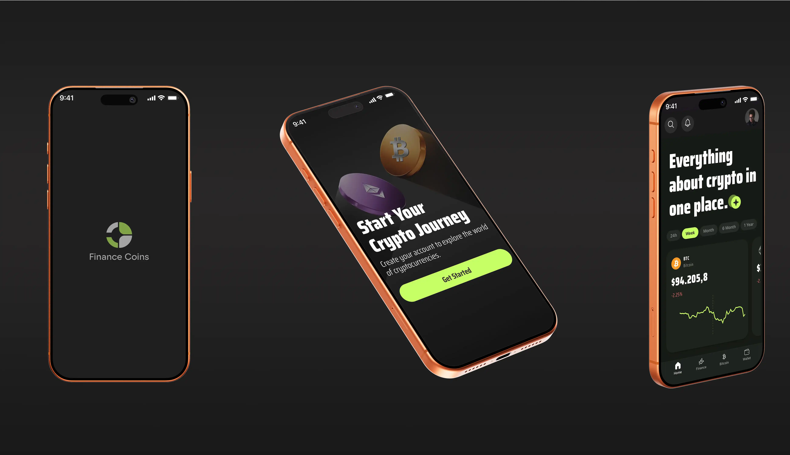

💰 Finance Coins

Aplicativo mobile para monitoramento de criptomoedas, cotação em tempo real, gráficos dinâmicos e acompanhamento financeiro. Construído com foco em velocidade, experiência fluida e interface moderna.

<p align="center">
  
</p>


<p align="left">      </p>

📱 Funcionalidades

📊 Dashboard com saldo total e variação do mercado

💹 Gráficos dinâmicos das criptomoedas mais populares

🔄 Atualização automática das cotações

🔍 Pesquisa de moedas

🧭 Navegação fluida com Expo Router

⚡ Uso otimizado de estado com TypeScript + Hooks

🎨 Design limpo com ícones de criptomoedas em alta qualidade


🚀 Tecnologias

React Native (Expo)

TypeScript

Expo Router

Axios

React Native Reanimated

Context API

AsyncStorage

API de criptomoedas (Binance)

⚙️ Como rodar o projeto
1. Instale as dependências

   ```bash
   npm install
   ```

2. Inicie o app

   ```bash
   npm start
   ```

Abra em:

Expo Go

Build de desenvolvimento

Emulador Android

Simulador iOS


📚 Documentação recomendada

Expo: https://docs.expo.dev

Expo Router: https://docs.expo.dev/router/introduction/

Tutorial oficial: https://docs.expo.dev/tutorial/introduction/

👤 Autor

Jones Lima — Full Stack Developer

GitHub: https://github.com/jonesrasta

🪪 Licença

Projeto licenciado sob MIT.
